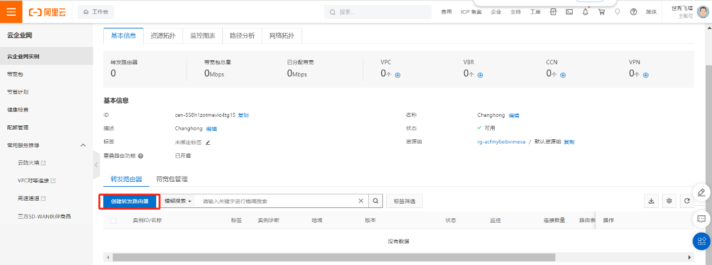

# 计算巢一键部署SD-WAN

# 1 概述

* 目前阿里云VPN产品已经实现了BGP动态路由、VPN-attachment接入TR等功能。
  BGP动态路由功能是在IPsec-VPN连接的基础上增加的子功能，它集成CEN动态路由收发能力，可以帮助用户更高效、灵活且可靠的建立IPsec-VPN连接，实现云上和云下网络的互通。详情参阅[文档](https://help.aliyun.com/document_detail/170235.html)。

* VPN-attachment可以从TR侧学习云上路由，也可以将从云下学习到的路由或用户配置在VPN-attachment上的路由同步给TR；详情参阅[文档](https://ata.alibaba-inc.com/articles/243091?spm=a1z2e.12184483.learn.darticletitle1.e2664f9bm4Z5io)。

* BGP动态路由、VPN-attachment接入TR各有优势，可以考虑将这两个功能结合起来实现上述客户的需求。本文档将结合BGP动态路由以及VPN-attachment接入TR这两个功能，通过计算巢一键部署VPN attachment for SDWAN的场景。

# 2 方案拓扑

# 3 前提条件

1. 必须要创建云企业网（CEN）;
2. 必须要创建转发路由器（TR）;
3. 必须要有一个创建Region（根据场景不同，创建多区域Region）;

## 3.1 创建CEN

点击确认，完成CEN的创建

## 3.2 创建TR

点击云企业网进入创建TR

点击确认，北京区域的TR创建完成

杭州区域的TR创建完成

2个区域的TR创建完成

# 4 一键部署SD-WAN

## 4.1 云市场查找计算巢部署界面

在搜索框中输入：Fortinet SD-WAN查找计算巢服务

## 4.2 从计算巢界面找部署界面

1. Fortinet SD WAN是通过Token形式激活SD-WAN服务
2. Fortinet SD WAN-File是通过激活文件的形式激活SD-WAN服务

## 4.3 购买Token形式的授权文件

在搜索框中输入：License Fortinet查找购买授权文件

可以根据购买时间购买，选好服务版本后立即购买

在已购服务中找到购买的License，点击详情

然后复制后续部署使用

## 4.4 部署SD-WAN

1. 付费类型根据需求选择 
2. 北京区域里面可用区根据实际需求选择 
3. 地址段设计（根据实际需求规划地址段）

选择创建的云企业网以及计算巢放置在所需要的TR中（此处放在北京TR中）

实例类型规格选择，目前以上是所有的规格型号，此部署以2vCPU 4GiB的规格部署

根据Token的授权方式激活计算巢服务

其他配置一样，就是激活方式不一样，以上是以授权文件形式激活。

立即支付部署SD-WAN

进入计算巢查看部署进度

查看进度，大概3-5分钟部署完成

部署完成，等1分钟可以通过Endpoint web登录，然后进入工作台查看ECS

初始登录用户名是admin 密码是ECS的实例ID号

登录进设备首先需要修改密码，旧密码是实例ID号，然后新密码设置

登录进SD-WAN设备

## 4.5 验证配置

### 4.5.1 SD-WAN设备配置验证

跟云内已经自动对接完成

策略已经自动配置完成

BGP已经自动对接完成，已经学习到云上的路由

### 4.5.2 云上配置验证

实例自动创建完成

VPC自动创建完成

VSwitch自动创建完成

云上VPN以及BGP自动创建完成

北京区域可以自动学习SD-WAN的路由	
